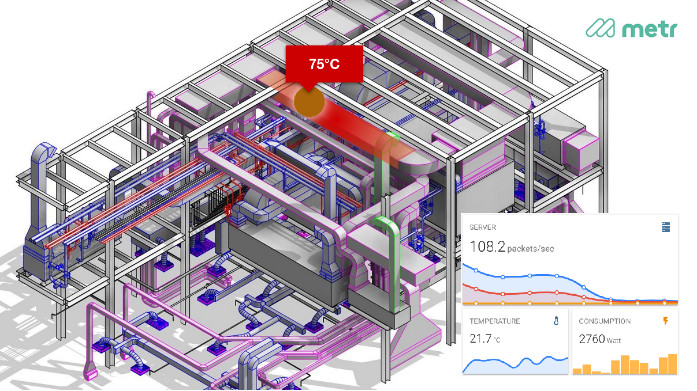

# visense

3D visualization for IoT data for metr.systems

this repo contains sample data for the visense project, consisting of 3D gltf models and sensor data.

The aim of visense is to develop a solution for visualizing IoT sensors and their data in 3D building models. We will bring together two cutting edge technologies: Building Information Modeling (BIM) and Internet of Things (IoT) to find a way to represent sensors in 3D space and visualize their data in a comprehensible way to maintenance staff. We will look at different aspects of how to visualize pipes, ducts and sensors to make users understand how systems are connected and which role the element plays they are looking at. Each sensor will have a small dashboard presenting current values, time series and related sensors. 

